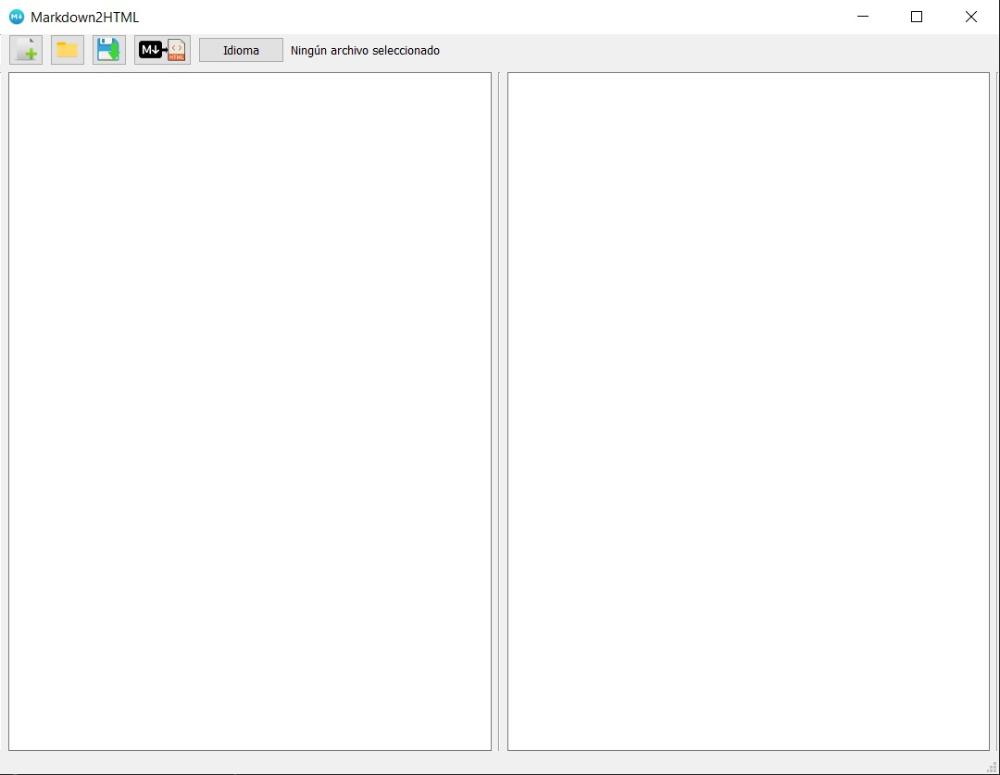
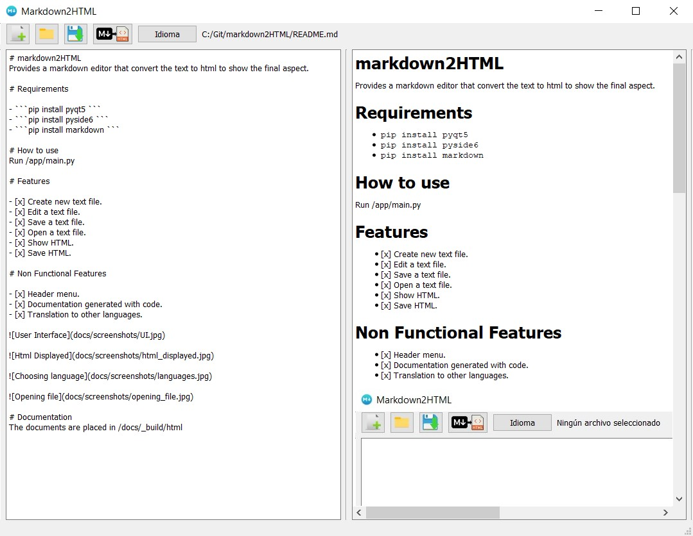

# markdown2HTML
Provides a markdown editor that convert the text to html to show the final aspect.

# Requirements

1- install PyQt5

# Features

- [x] Create new text file.
- [x] Edit a text file.
- [x] Save a text file.
- [x] Open a text file.
- [x] Show HTML.
- [x] Save HTML.

# Non Functional Features

- [x] Header menu.
- [x] Documentation generated with code.
- [ ] Translation to other languages.

# Documentation
The documents are placed in /docs/_build/html
